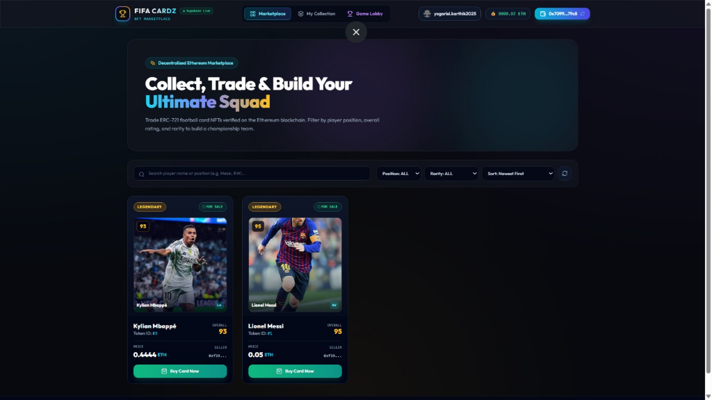
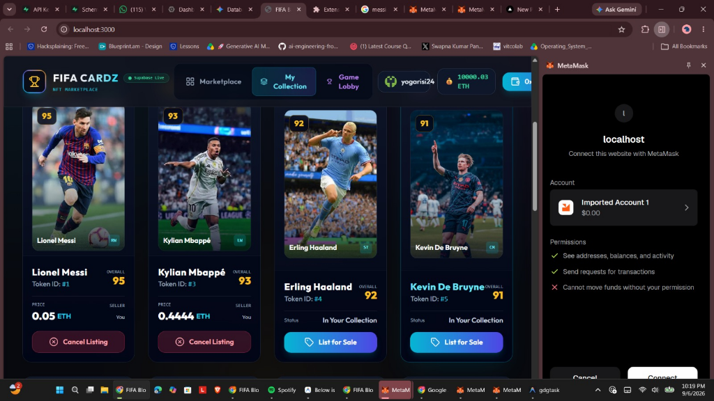

# FIFA CARDZ — Decentralized ERC-721 NFT Marketplace & Draft Game

FIFA CARDZ is a Web3 application built for minting, listing, buying, and trading unique FIFA Football Card NFTs on the Ethereum blockchain. It also includes an interactive 4-round multiplayer draft game where players answer football trivia to gain draft priority for unique player cards.

---

## 🌟 Features

- **ERC-721 Smart Contracts (`FootballCard.sol`)**: Mint unique player card NFTs with token IDs and IPFS/JSON metadata.
- **Marketplace Contract (`Marketplace.sol`)**:
  - `listItem()`: List owned cards for sale with an ETH price (handles `setApprovalForAll` approvals).
  - `buyItem()`: Purchase cards directly; automatically transfers the NFT to the buyer and sends ETH to the seller.
  - `cancelListing()`: Cancel active card listings anytime.
  - Reentrancy protection via OpenZeppelin `ReentrancyGuard`.
- **Marketplace & Filters**: Search cards by player name, filter by position/rarity, and sort by price or rating.
- **My Collection**: Displays cards owned by the connected wallet and squad overall rating.
- **Admin Mint Portal**: Admin interface for minting new cards via presets or IPFS URIs.
- **4-Round Quiz & Draft Game**:
  - 4 position rounds: Goalkeeper (GK), Defender (DEF), Midfielder (MID), Attacker (FWD).
  - Trivia quiz with a live timer determining 1st, 2nd, and 3rd draft priority based on accuracy and speed.
  - **Strict Unique Token Draft**: Players draft actual unique NFT card tokens so no two players get duplicate cards.

## 📸 Application Screenshots

### 🖼️ Marketplace Gallery & Listings


### 📦 My Collection & MetaMask Wallet Connection


---

## 🛠 Tech Stack

- **Smart Contracts**: Solidity `^0.8.24`, Hardhat, OpenZeppelin (`ERC721URIStorage`, `Ownable`, `ReentrancyGuard`).
- **Frontend**: React 18, Vite, Tailwind CSS, Lucide icons.
- **Web3 Provider**: Ethers.js v6, MetaMask.
- **Backend / Realtime**: Supabase (PostgreSQL & Realtime updates).

---

## 🚀 How to Run Locally

### 1. Install dependencies

```bash
# Contract dependencies
cd contracts
npm install

# Frontend dependencies
cd ../frontend
npm install
```

### 2. Run smart contract unit tests

```bash
cd contracts
npm test
```
*Runs all 15 unit tests covering minting, marketplace approvals, ETH transfers, and listing cancellations.*

### 3. Start local Hardhat node & deploy contracts

```bash
# Terminal 1: Start local node
cd contracts
npx hardhat node

# Terminal 2: Deploy contracts and mint initial cards
cd contracts
npx hardhat run scripts/deploy.js --network localhost
npx hardhat run scripts/mintInitialCards.js --network localhost
```

### 4. Start frontend dev server

```bash
# Terminal 3: Start Vite app
cd frontend
npm run dev
```

Open **`http://localhost:3000`** in your browser.

---

## 🎮 How to Test the Game Engine (Multiplayer Mode)

To test the draft game locally without needing 3 separate browser windows:

1. Open the **Game Lobby** tab.
2. Select **Host a Game** or **Join a Game**.
3. Click the **`+ Connect Test Player`** button in the room lobby to fill player slots.
4. Click **Start Match** to go through all 4 quiz rounds and card draft selections.

---

## 🔐 Note on Authentication

> **Note**: Google OAuth sign-in is currently under development. For testing, please register/sign in using **Email & Password** or connect directly via **MetaMask Wallet**.

---

## 📁 Repository Structure

```text
fifa-blockchain-card-game/
├── contracts/
│   ├── contracts/
│   │   ├── FootballCard.sol
│   │   └── Marketplace.sol
│   ├── scripts/
│   │   ├── deploy.js
│   │   └── mintInitialCards.js
│   ├── test/
│   │   └── FootballCard.test.js
│   └── hardhat.config.js
├── frontend/
│   ├── src/
│   │   ├── components/
│   │   ├── context/
│   │   ├── contracts/
│   │   ├── hooks/
│   │   ├── lib/
│   │   ├── pages/
│   │   └── App.jsx
│   └── package.json
├── assets/
│   └── metadata/
├── supabase/
│   └── schema.sql
└── README.md
```
